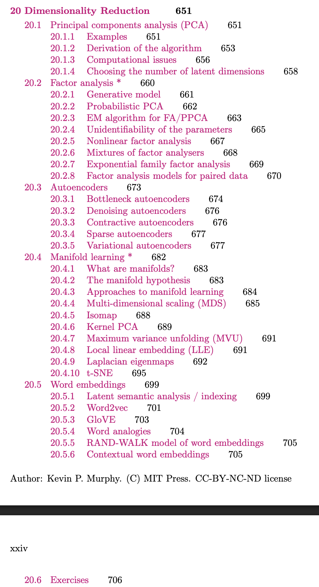

# dimensionality-reduction
Repository to store presentation and notebooks for CCMI data driven modelling

## Structure

For each method include mathematical overview, motivation, when it is good/ not so good and an implementation in Jupyter notebook,

### slide 1

- why dimensionality reduction
- applications
- types of dimensionality reduction (supervised, unsupervised, linear, non-linear, deep learning)
- how to evaluate dimensionality reduction

### slide 2 - Lewis

- Linear methods
- PCA 

### slide 3 - Ammar

- Non-linear methods
- UMAP , t-SNE

### NMF (or any other cool methods) - constrained/ interpretable dimensionality reduction - Callum

- Interesting methods

- NMF

 

### slide 4 - Skye

- Deep learning methods
- Autoencoders
- Variational Autoencoders